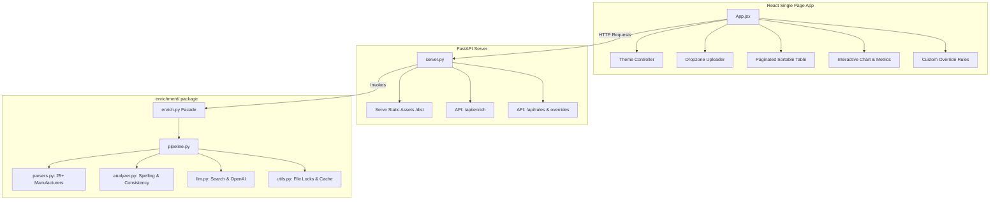

# Equiply Data Enrichment Portal

An intelligent, self-healing, and WCAG 2.2 AA-compliant hospital equipment data enrichment dashboard and CLI application. 

VIDEO: https://www.youtube.com/watch?v=Ar72ZvwpCqo

This portal processes raw, messy hospital equipment logs (containing mismatched manufacturers, typos in model names, and complex/inconsistent serial numbers), normalizes the metadata, and enriches it with:
1. **Standardized Device Types** (e.g., Defibrillator, Infusion Pump, Ventilator).
2. **Accurate Manufacture Dates** resolved from manufacturer-specific serial format parsers, DuckDuckGo searches, and OpenAI consensus logic.

---

## Table of Contents
- [Project Overview](#project-overview)
- [Key Features](#key-features)
- [System Architecture](#system-architecture)
- [Data Enrichment & Self-Healing Pipeline](#data-enrichment--self-healing-pipeline)
- [WCAG 2.2 AA Compliance Summary](#wcag-22-aa-compliance-summary)
- [Setup & Installation](#setup--installation)
- [Usage Guide](#usage-guide)
  - [CLI Enrichment Engine](#cli-enrichment-engine)
  - [Local FastAPI & React Dashboard](#local-fastapi--react-dashboard)
- [Testing Suite](#testing-suite)
- [File Structure](#file-structure)

---

## Project Overview

Hospital inventory systems often contain entries with:
- **Typographical errors**: (e.g., `M1722A` vs `M1722 A`, spelling mistakes like `American Diagnostcs`).
- **Missing or inconsistent fields**: Unknown device types or serial numbers without manufacture dates.
- **Varying serial formats**: Every manufacturer encodes manufacture dates differently (e.g., GE uses year/week codes, American Diagnostics uses specific prefixes, ZOLL embeds dates in alphanumeric patterns).

Equiply solves this by combining local, high-speed heuristic parsers for 25+ major medical manufacturers, a dynamic self-healing consistency engine that applies majority-based rules across the dataset (e.g., fixing missing serial prefixes or spacing typos), and an LLM/Web-search consensus system for fallback resolution.

---

## Key Features

- 🛠️ **Modular & Elif-Free Engine**: Replaced complex conditional chains with a registry-based, pattern-matching design.
- 🔄 **Self-Healing Consistency**: Analyzes the dataset as a whole to learn prefix patterns (like American Diagnostics requiring `C` in front of serial numbers) and spelling corrections (Levenshtein distance matching), applying corrections dynamically and writing them to a `formatting_corrections.txt` report exposed to the frontend.
- 🌐 **Web & LLM Consensus**: Performs DuckDuckGo web searches and runs consensus logic using gpt-5.4-mini (OpenAI API) to resolve unknown formats and ensure high data accuracy.
- 🗄️ **Thread-Safe Cached Storage**: Fast, locked cache mechanisms prevent redundant LLM and Search queries.
- ♿ **WCAG 2.2 AA Compliance**: Built for everyone with semantic HTML5 elements, keyboard-accessible upload zones and table headers, high-visibility focus states, and >4.5:1 color contrast ratios in both light and dark themes.
- 📊 **Interactive Dashboard**: Modern glassmorphic frontend built with React and Vite, featuring distribution charts, paginated and searchable records tables, a real-time rules manager, manual override rules, and an auto-applied corrections log.

---

## System Architecture

The project is structured with a clean separation of concerns between the backend pipeline (Python) and the frontend dashboard (React).



### Module Breakdown

1. **`enrich.py` (Facade)**: Provides a single, clean API entry point for both the CLI utility and the FastAPI backend.
2. **`enrichment/pipeline.py`**: Controls the multi-pass enrichment pipeline. Handles CSV reading/writing, duplicate removal, metric calculations, and report generation.
3. **`enrichment/parsers.py`**: Houses individual, isolated parsers for 25+ manufacturers. Employs a dispatcher registry to parse serial numbers locally in sub-millisecond execution times.
4. **`enrichment/analyzer.py`**: Computes Levenshtein distances to correct spelling typos and executes format consistency checks to repair structural serial number issues.
5. **`enrichment/llm.py`**: Coordinates DuckDuckGo web lookups and queries OpenAI consensus prompts to resolve unknown devices.
6. **`enrichment/utils.py`**: Manages environment variables, thread-safe file locks, date normalizations (e.g. mapping out-of-bounds dates to `1900-01-01`), and JSON cache files.

---

## Data Enrichment & Self-Healing Pipeline

The pipeline operates in multiple passes to clean and enrich data:

```
Raw CSV ➔ Deduplication ➔ Formatting Analyzer ➔ Local Registry Parsers ➔ Web & LLM Fallback ➔ Cache Rules ➔ Enriched Output
```

1. **Deduplication**: Drops exact duplicates in the input dataset.
2. **Self-Healing Format Analysis**:
   - **Prefix Alignment**: Scans serial prefixes per manufacturer. If the vast majority (e.g., American Diagnostics) start with a prefix like `C`, it prepends `C` to the outlier serial numbers, correcting typos.
   - **Model Normalization**: Standardizes spacing (e.g. `M SERIES` vs `MSERIES`) and corrects near-matches using Levenshtein distance.
   - **Report Writing**: Logs all formatting corrections to `formatting_corrections.txt` and probable typos to `probable_typos.txt`.
3. **Local Date Parsing**: Maps the serial number to its manufacturer's format rule (e.g., `Welch Allyn` serials starting with `H` signify the year, GE serials starting with letters signify manufacturing week/year).
4. **Search & LLM Consensus Fallback**: If local parsing fails, the system executes two passes (one for Device Type, one for Date) searching DuckDuckGo and passing findings to gpt-5.4-mini to extract a logical consensus.
5. **Caching & Rules Storage**: Outputs are cached in local JSON structures (`device_rules_cache.json`, `device_types_cache.json`, `serial_dates_cache.json`) to guarantee sub-millisecond lookups for subsequent runs.

---

## WCAG 2.2 AA Compliance Summary

The web dashboard is fully compliant with **WCAG 2.2 AA** standards. Key enhancements include:

* **Color Contrast (Success Criterion 1.4.3 & 1.4.11)**: All text elements, form fields, and status badges satisfy a contrast ratio of at least 4.5:1 (and 3:1 for large text/icons) against their backgrounds in both Dark and Light themes.
* **Keyboard Navigation (Success Criterion 2.1.1)**:
  - The custom Drag & Drop upload zone is focusable and can be activated via `Space` or `Enter`.
  - Data table headers can be focused and toggled for sorting via the keyboard.
  - Form fields, buttons, and pagination controls support intuitive `Tab` indexing.
* **Focus Visible (Success Criterion 2.4.7)**: Interactive elements display a high-contrast focus ring (`3px solid hsl(var(--primary-color))` with a `2px` offset) when navigated via keyboard.
* **Screen Reader Accessibility (ARIA & Semantics)**:
  - Implements semantic HTML5 layout tags: `<header>`, `<main>`, `<aside>`, `<section>`, `<nav>`.
  - Accessible names are declared for all icon buttons, search boxes, and theme controls.
  - Decorative elements and icons are explicitly hidden from screen readers using `aria-hidden="true"`.
  - Form fields are explicitly connected to `<label>` tags.

---

## Setup & Installation

### Prerequisites
- Python 3.10+
- Node.js 18+
- [uv](https://github.com/astral-sh/uv) (recommended Python package manager)

### Installation Steps

1. **Clone the repository**:
   ```bash
   git clone <repository_url>
   cd equiply-challenge
   ```

2. **Set up Python virtual environment and dependencies**:
   ```bash
   # Using uv (Recommended)
   uv venv
   source .venv/bin/activate
   uv pip install -r requirements.txt

   # Or using standard pip
   python3 -m venv .venv
   source .venv/bin/activate
   pip install -r requirements.txt
   ```

3. **Install Frontend Dependencies**:
   ```bash
   npm install
   ```

4. **Environment Variables**:
   Create a `.env` file in the root directory to store your OpenAI API Key (required for LLM fallback lookups):
   ```ini
   OPENAI_API_KEY=your-openai-api-key-here
   ```

---

## Usage Guide

### CLI Enrichment Engine

To run the enrichment pipeline directly from the command line:

```bash
uv run python3 enrich.py <input_csv_path> <output_csv_path>
```

*Example*:
```bash
uv run python3 enrich.py challenge_data-v1.csv challenge_data_enriched.csv
```

The output file will contain the cleaned records with the added `device_type` and `manufactured_date` columns, and reports will be saved locally as `formatting_corrections.txt` and `probable_typos.txt`.

### Local FastAPI & React Dashboard

The FastAPI server acts as both the API server and the host for the compiled React frontend.

1. **Build the React frontend static assets**:
   ```bash
   npm run build
   ```
   This generates the optimized, WCAG-compliant static assets inside the `dist/` directory.

2. **Start the FastAPI server**:
   ```bash
   uv run python3 server.py
   ```
   The backend will start on `http://localhost:8000`.

3. **Access the Dashboard**:
   Open [http://localhost:8000](http://localhost:8000) in your web browser. You can now:
   - Drag and drop your equipment CSV files.
   - Monitor the auto-applied spelling and serial corrections.
   - Add manual rule overrides.
   - Inspect device metrics and download the enriched CSV.

*Note for frontend developers*: You can run the Vite dev server concurrently via `npm run dev` to enable Hot Module Replacement (HMR) during frontend-only editing. The frontend defaults to proxied backend calls at `http://localhost:8000`.

---

## Testing Suite

The project includes unit tests to verify the parsing logic for serial numbers. Run the test suite with:

```bash
uv run python3 test_enrich_logic.py
```

---

## File Structure

```
equiply-challenge/
├── enrichment/                    # Core Python pipeline package
│   ├── __init__.py                # Package initializer
│   ├── utils.py                   # Date normalization, caches, env, locks
│   ├── parsers.py                 # 25+ local manufacturer date parsers
│   ├── analyzer.py                # Levenshtein distance & prefix analyzer
│   ├── llm.py                     # Web search and LLM consensus resolution
│   └── pipeline.py                # Multi-pass CSV flow control & report writer
├── src/                           # React frontend codebase
│   ├── assets/                    # Graphic assets
│   ├── App.css                    # Dashboard custom CSS rules
│   ├── App.jsx                    # Main React application & dashboard layout
│   ├── index.css                  # Theme colors, variables, & WCAG utilities
│   └── main.jsx                   # React entry point
├── dist/                          # Compiled production-ready React assets
├── enrich.py                      # Facade layer & CLI utility entrypoint
├── server.py                      # FastAPI production server
├── test_enrich_logic.py           # Unit tests
├── pyproject.toml                 # uv dependency configurations
├── requirements.txt               # Frozen dependencies
├── package.json                   # npm scripts and node dependencies
├── .env                           # Local environment variables
└── README.md                      # System documentation (this file)
```
